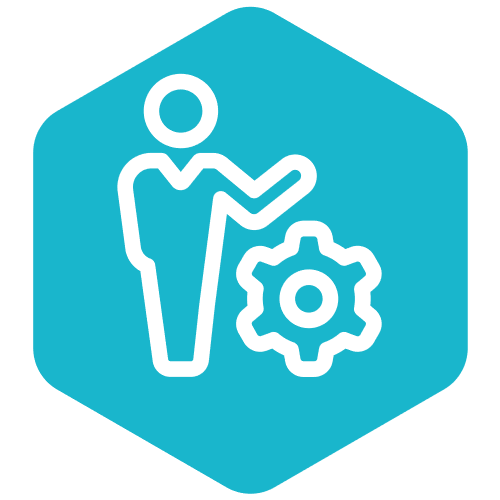
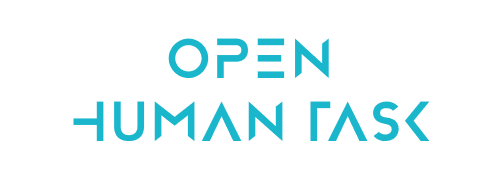

  
   
  

 

## About

The Open Human Task (OHT) declares a vendor-neutral, open-source, free and community-driven specification for defining, running and managing Domain Specific Language (DSL) based human interactions with modern software ecosystems. 

The Open Human Task DSL is heavily based on the (awesome) [WS-Human Task Specification](http://docs.oasis-open.org/bpel4people/ws-humantask-1.1-spec-cs-01.html), which it intends to be a modernization of.

The project is composed of:

- [Specification](specification.md) to define and document the OHT DSL.
- [Software Development Kits (SDKs)]() to read, write, parse and validate `Human Task Definitions` in multiple languages.
- [Runtimes](): to manage, serve, render and execute `Human Task Definitions`.

## Table of Contents

- [Releases](#releases)
- [Community](#community)
  - [Governance](#governance)
  - [Owners](#owners)
  - [Roles and Responsibilities](#roles-and-responsibilities)
    - [Maintainers](#maintainers)
    - [Reviewers](#reviewers)
  - [Communications](#communications)
  - [Code of Conduct](#code-of-conduct)
  - [Meetings](#meetings)

## Releases

| Latest release | Latest release | Branch | Working branch |
|----------------|----------------|--------|----------------|
| **Core** |
| [Human Task Specification](specification.md) | [v0.1.0]() | [0.1.x]() | [main](https://github.com/openhumantask/specification) |
| **SDKs** |
| [.NET SDK](https://github.com/openhumantask/sdk-net) | [v0.1.0]() | [0.1.x]() | [main](https://github.com/openhumantask/sdk-net) |

## Community

### Governance

### Roles and Responsibilities

#### Maintainers

  - [cdavernas](https://github.com/cdavernas)
  - [JBBianchi](https://github.com/jbbianchi)
  
#### Reviewers

  - [tsurdilo](https://github.com/tsurdilo)
  - [thabart](https://github.com/thabart)

### Communications

Join us on:

 - [Slack](https://join.slack.com/t/openhumantask/shared_invite/zt-1hopjg6kw-R0SiYhCheH01BDFWeRsi6g)

### Code of Conduct

### Meetings
