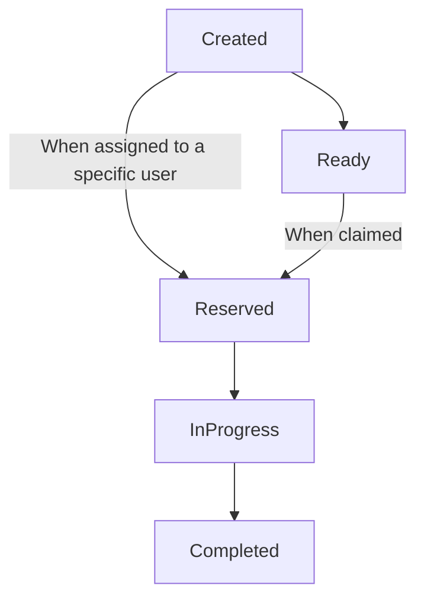
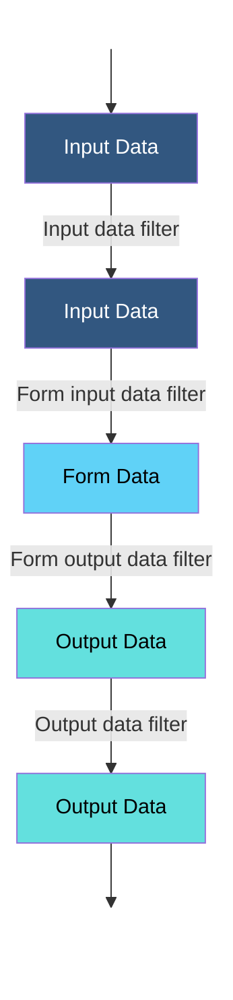

# Human Task Specification

## Table of Contents

- [Introduction](#introduction)
- [Specification](#specification)
  - [Core Concepts](#core-concepts)
    - [Generic Human Roles](#generic-human-roles)
      - [Potential initiators](#potential-initiators)
      - [Potential owners](#potential-owners)
      - [Excluded owners](#excluded-owners)
      - [Stakeholders](#stakeholders)
      - [Business Administrators](#business-administrators)
    - [Lifecycle](#lifecycle)
    - [Data](#data)
      - [Operational Context](#operational-context)
      - [Data Flow](#data-flow)
    - [Deadlines](#deadlines)
    - [Escalations](#escalations)
    - [Notifications](#notifications)
  - [Implementation Guidelines](#implementation-guidelines)
    - [API](#api)
    - [Cloud Events](#cloud-events)
  - [Definitions](#definitions)
    - [Human Task Definitions](#human-task-definitions)
    - [People Assignments Definitions](#people-assignments-definitions)
    - [People Reference Definitions](#people-reference-definitions)
    - [Users Reference Definitions](#users-reference-definitions)
    - [Logical People Group Definitions](#logical-people-group-definitions)
    - [Form Definitions](#form-definitions)
    - [View Definitions](#view-definitions)
    - [Notification Definitions](#notification-definitions)
    - [Deadline Definitions](#deadline-definitions)
    - [Escalation Definitions](#escalation-definitions)
    - [Escalation action Definitions](#escalation-action-definitions)
      - [Notification](#notification-escalation-action-definitions)
      - [Reassignment](#reassignment-escalation-action-definitions)
      - [SubTask](#subtask-escalation-action-definitions)

## Introduction

### Core concepts

#### Generic Human Roles

*Coming soon...*

##### Potential initiators

###### Description

Defines the potential initiators of the task. Implementations should allow users to instanciate the tasks they are the potential initiators of.

###### Permissions

- Instanciate the task.

##### Potential owners

###### Description

Defines the persons who receive the task so that they can claim and complete it. A potential owner becomes the actual owner of a task by explicitly claiming it. Before the task has been claimed, potential owners can influence the progress of the task, for example by changing the priority of the task, adding ad-hoc attachments or comments.

###### Permissions

- Claim tasks.
- Change priority *(only before task has been claimed)*.
- Add attachment *(only before task has been claimed)*.
- Add comment *(only before task has been claimed)*.

##### Excluded owners

###### Description

Defines the users that are excluded from performing (and otherwise know/do anything about) the task.

###### Permissions

None.

##### Stakeholders

###### Description

Defines the people ultimately responsible for the oversight and outcome of the task. A task stakeholder can influence the progress of a task, for example, by adding ad-hoc attachments, forwarding the task, or simply observing the state changes of the task.  It is also allowed to perform administrative actions on the task instance and associated notification(s), such as resolving missed deadlines.

###### Permissions

- Add/remove attachment.
- Add comment.
- Receive notifications.
- Forward tasks.
- Release tasks.

##### Business administrators

###### Description

Business administrators play the same role as task stakeholders but at task definition level. Therefore, business administrators can perform the exact same operations as task stakeholders. Business administrators can also observe the progress of notifications.

###### Permissions

- Add/remove attachment.
- Add comment.
- Receive notifications.
- Forward tasks.
- Release tasks.
- Edit task definition.

#### Lifecycle



#### Data flow



#### Deadlines

*Coming soon...*

#### Escalations

*Coming soon...*

#### Notifications

*Coming soon...*

### Implementations guidelines

*Coming soon...*

#### API

*Coming soon...*

#### Cloud Events

*Coming soon...*

### Definitions

#### Human Task Definitions

##### Description

Defines a human task and configures its behaviors.

##### Properties

| Name | Type | Required | Runtime<br>Expression | Description |
|------|:----:|:--------:|:---------------------:|-------------|
| id | `string` | `yes` | `no` | A string that globally and uniquely identifies the human task definition. <br>*MUST be lowercase and must only contain alphanumeric characters, with the exception of the `.` and `-` characters. <br>It is recommended for the id to be automatically generated by implementations, following the `{namespace}.{name}:{version}` format.* |
| name | `string` | `yes` | `no` | The name of the human task definition. <br>*Must be lowercase and only contain alphanumeric characters, with the exceptions of the `-` character.** |
| namespace | `string` | `yes` | `no` | The namespace the human task definition belongs to. <br>*Must be lowercase and only contain alphanumeric characters, with the exceptions of the `-` and `.` characters.* |
| version | `string` | `yes` | `no` | The [semantic version](https://semver.org/) of the human task definition. |
| specVersion | `string` | `yes` | `no` | The Human Task spec version to use. <br>*Defaults to the latest released spec version.* |
| expressionLanguage | `string` | `yes` | `no` | The language to use to evaluate [runtime expression](#runtime-expression)s.<br>*Defaults to [`jq`](https://stedolan.github.io/jq/).* |
| key | `string` | `no` | `yes` | A literal or a [runtime expression](#runtime-expression) used to generate the keys of instanciated human tasks. It could be used, in the case of a purchase review, to set the reviewed purchase order's id as the human task's key   |
| title | `object` | `no` | `yes` | The mappings of localized titles to their two-letter **ISO 639-1** language names. Titles are used as human task localized display name. |
| subject | `object` | `no` | `yes` | The mappings of localized subjects to their two-letter **ISO 639-1** language names. |
| description | `object` | `no` | `yes` | The mappings of localized descriptions to their two-letter **ISO 639-1** language names. |
| peopleAssignments | [`peopleAssignmentsDefinition`](#people-assignments-definitions) | `yes` | `no` | The configuration of the task's people assignments to generic roles. |
| inputDataSchema | [`jsonSchema`](https://json-schema.org/) | `no` | `no` | A [`JSON Schema`](https://json-schema.org/) use to define and validate inputs of the human task definition's instances. | 
| outputDataSchema | [`jsonSchema`](https://json-schema.org/) | `no` | `no` | A [`JSON Schema`](https://json-schema.org/) use to define and validate outputs of the human task definition's instances. | 
| form | `string`<br>[`formDefinition`](#form-definitions) | `yes` | `no` | Configures the task's form.<br>*If a `string`, an uri referencing the external [form definition](#form-definition).*<br>*If an `object`, the inline configuration of the human task's [form definition](#form-definition).* |
| notifications | [`notification[]`](#notification-definitions) | `no` | `no` | An array containing the human task's [`notifications`](#notification-definitions). |
| deadlines | [`deadlineDefinition[]`](#deadline-definitions) | `no` | `no` | An array containing the [`deadlines`](#deadline-definitions) of the human task's instances. |
| annotations | `array`<br>`object` | `no` | `no` | An array of string-based key/value pairs containing helpful terms used to describe the human task intended purpose, subject areas, or other important qualities.
| metadata | `object` | `no` | `no` | An object used to provide additional unstructured information about the human task definition. May be used by implementations to define additional functionality. | 

##### Examples

```yaml
id: openbank.loan-management.loan-approval-request:1.0.5
name: loan-approval-request
namespace: openbank.loan-management
version: '1.0.0'
specVersion: '0.1'
expressionLanguage: jq
key: '${ .case.reference }'
title:
  fr: Examiner requête de crédit
  en: Review loan request
subject:
  fr: Crédits à tempérament
  en: Installment credits
description:
  fr: Examiner une requête de crédit à tempérament
  en: Review an installment credit request 
inputDataSchema: https://foo-bank.com/schemas/humantasks/input.json
outputDataSchema: https://foo-bank.com/schemas/humantasks/output.json
form:
  data:
    schema: https://foo-bank.com/schemas/humantasks/form.data.json
  view: openbank.loan-management.forms.loan-approval-request:1.0.0
notifications:
  - name: task-pending-reminder
    view: openbank.loan-management.notifications.task-pending-reminder:1.0.0
    input: '${ .input }
    recipients:
      - user: alan
deadlines:
  - name: approve-before-48h
    type: start
    duration: P2D
    escalations:
      - name: reminder
        action:
          notification: task-pending-reminder
outcomes:
  - name: approved
    condition: '${ .output.approved and .output.approverId != null }'
  - name: rejected
annotations:
  tags: loan approval
metadata:
  x-obms-css-lib: adminkit
```
#### People Assignments Definitions

###### Description

Represents the definition used to configure people assignments for instance of the human task definition.

###### Properties

| Name | Type | Required | Runtime<br>Expression | Description |
|------|:----:|:--------:|:---------------------:|-------------|
| [potentialOwners](#potential-owners) | [`peopleReferenceDefinition[]`](#people-reference-definitions) | `yes` | `no` | The [potential owners](#potential-owners) of the task.<br>*Must contain at least one [`people reference`](#people-reference-definitions).* |
| [excludedOwners](#excluded-owners) | [`peopleReferenceDefinition[]`](#people-reference-definitions) | `no` | `no` | The [excluded owners](#excluded-owners) of the task. |
| [potentialTaskInitiators](#potential-task-initiators) | [`peopleReferenceDefinition[]`](#people-reference-definitions) | `no` | `no` | The [potential initiators](#potential-task-initiators) of the task. |
| [taskStakeholders](#stakeholders) | [`peopleReferenceDefinition[]`](#people-reference-definitions) | `no` | `no` | The [stakeholders](#stakeholders) of the task. |
| [businessAdministrators](#businessAdministrators) | [`peopleReferenceDefinition[]`](#people-reference-definitions) | `no` | `no` | The [business administrators](#business-administrators) of the task. |
| [notificationRecipents](#notification-recipents) | [`peopleReferenceDefinition[]`](#people-reference-definitions) | `no` | `no` | The [recipients of all notifications](#notification-recipents) produced by the task. |
| groups | [`logicalPeopleGroupDefinition[]`](#logical-people-group-definitions) | `no` | `no` | An array containing the [`logical people groups`](#logical-people-group-definition) defined for the task's scope. |
###### Examples

```yaml
...
peopleAssignments:
  potentialOwners:
    - user: alan
...
```

#### People Reference Definitions

###### Description

Represents an object used to reference a user or a group of users based on given parameters.

###### Properties

| Name | Type | Required | Runtime<br>Expression | Description |
|------|:----:|:--------:|:---------------------:|-------------|
| user | `string` | `depends` | `yes` | References the user with the specified id, as defined by the JWT `sub` claim.<br>*Required if `users` has not been set.* |
| users | [`usersReferenceDefinition`](#users-reference-definitions) | `depends`| `no` | References multiple users that match the defined filters.<br>*Required if `user` has not been set.* |

###### Examples

*Example of a definition referencing a single person by id:*

```yaml
...
- user: alan
...
```

*Example of a definition referencing anyone that has a claim of type `task:perform` as well as a claim of type `division-role` with the value equal to `clerk`:*

```yaml
...
- users:
    withClaims:
      - type: 'task:perform'
      - type: division-role
        value: clerk
...
```

#### Users Reference Definitions

###### Description

Represents an object used to reference multiple users based on given parameters.

###### Properties

| Name | Type | Required | Runtime<br>Expression | Description |
|------|:----:|:--------:|:---------------------:|-------------|
| withClaims | [`claimFilterDefinition[]`](#claim-filter-definitions) | `depends` | `no` | The claims to filter by the users to reference. |
| inGroup | `string` | `depends` | `yes` | The logical group that defines the users to reference. |
| [inGenericRole](#generic-task-roles) | `enum` | `depends` | `no` | The [generic role](#generic-task-roles) that defines the users to reference.<br>*Assignments of users to generic roles are delcared in the [human task definition's `peopleAssignments`](#human-task-definitions) property.*  |

###### Examples

*Example of a definition referencing users that match the specified [claim filters](#claim-filter-definitions):*

```yaml
...
- users:
    withClaims:
      - type: 'task:perform'
      - type: division-role
        value: clerk
...
```

*Example of a definition referencing the task's business administrators:*

```yaml
...
- users:
    inGenericRole: businessAdministrator
...
```

*Example of a definition referencing the people in the regional clerk group:*

```yaml
...
- users:
    inGroup: regional-clerks
...
```

#### Logical People Group Definitions

###### Description

Defines a logical group of people which can be referenced in the task's scope.

###### Properties

| Name | Type | Required | Runtime<br>Expression | Description |
|------|:----:|:--------:|:---------------------:|-------------|
| name | `string` | `yes` | `no` | The name used to referenced the group in the task's scope.<br>*Must be lowercase and only contain alphanumeric characters, with the exceptions of the `-` character.* |
| members | [peopleReferenceDefinition[]](#people-reference-definitions) | `yes` | `no` | An array containing the [people references](#people-reference-definitions) used to define the users belonging to the group.<br>*Must contain at least one [people reference](#people-reference-definitions).*|

###### Examples

```yaml
...
peopleAssignments:
  groups:
    - name: regionalClerks
      members:
        - user: alan
...
```

#### Form Definitions

###### Description

Represents the definition of an human task form, which is used to collect data from users.

###### Properties

| Name | Type | Required | Runtime<br>Expression | Description |
|------|:----:|:--------:|:---------------------:|-------------|
| data | [`formDataDefinition`](#form-data-definitions) | `no` | `no` | Configures the form's data |
| view | [`viewDefinition`](#view-definitions) | `yes` | `no` | Configures the form's view |

###### Examples

*Example of a form with an inline view:*

```yaml
...
form:
  data:
    filter:
      input: '${ .input.client }'
    schema: 
      type: object
      properties:
        client:
          type: object
          properties:
            firstName:
              type: string
            lastName:
              type: string
            email:
              type: string
              format: email
          required:
            - firstName
            - lastName
            - email
  view:
    type: jsonform
    template: >
      {
        "type": "VerticalLayout",
        "elements": [
        {
          "type": "Label",
          "text": "Review new client profile"
        },
        {
          "type": "Control",
          "scope": "#/properties/client/properties/firstName"
        },
        {
          "type": "Control",
          "scope": "#/properties/client/properties/lastName"
        },
        {
          "type": "Control",
          "scope": "#/properties/client/properties/email"
        }]
      }
...
```

#### View Definitions

###### Description

Represents the definition of a view.

###### Properties

| Name | Type | Required | Runtime<br>Expression | Description |
|------|:----:|:--------:|:---------------------:|-------------|
| type | `string` | `yes` | `yes` | The view type.<br>*Defaults to [`md`](https://www.markdownguide.org/).*<br>*Can be a [runtime expression](#runtime-expression).* |
| template | `string`<br>`object` | `yes` | `yes` | The view template.<br>*If a `string`, the raw template contents.*<br>*If an `object`, the inline template.*<br>*Can be a (or contain) [runtime expression(s)](#runtime-expression).* |

###### Examples

*Example of a view definition using a raw template (`string`):*

```yaml
  view:
    type: jsonform
    template: >
      {
        "type": "VerticalLayout",
        "elements": [
        {
          "type": "Label",
          "text": "Review new client profile"
        },
        {
          "type": "Control",
          "scope": "#/properties/client/properties/firstName"
        },
        {
          "type": "Control",
          "scope": "#/properties/client/properties/lastName"
        },
        {
          "type": "Control",
          "scope": "#/properties/client/properties/email"
        }]
      }
```

*Example of the same view definition, using an inline template (`object`):*

```yaml
...
  view:
    type: jsonform
    template:
      type: VerticalLayout
      elements:
      - type: Label
        text: Review new client profile
      - type: Control
        scope: "#/properties/client/properties/firstName"
      - type: Control
        scope: "#/properties/client/properties/lastName"
      - type: Control
        scope: "#/properties/client/properties/email"
...
```

#### Notification Definitions

###### Description

Represents the definition of a notification, which is use to communicate the status of the task to users.

###### Properties

| Name | Type | Required | Runtime<br>Expression | Description |
|------|:----:|:--------:|:---------------------:|-------------|
| name | `string` | `yes` | `no` | The name used to reference the notification definition.<br>*Must be lowercase and only contain alphanumeric characters, with the exceptions of the `-` character.* |
| view | `string`<br>`viewDefinition` | `yes` | `yes` | Configures the notification's view.<br>*If a `string`, represents the unique identifier of the template to use, using the `{namespace}.{name}:{version}` format.<br>If a `viewDefinition`, configures the view inline.<br>*Can be a [runtime expression](#runtime-expression).* |
| input | `string`<br>`object` | `no` | `yes` | If a `string`, is a [runtime expression](#runtime-expression) used to build the notification's input data based on the human task's data.<br>If an `object`, represents the input data of the notification to produce. [runtime expression](#runtime-expression)s can be used in any and all properties, at whichever depth. 
| recipients | [`peopleAssignmentDefinition[]`](#people-assignment-definition) | `yes` | `no` | An array that contains the notification's recipients.<br>*Must contain at least one [recipient](#people-assignment-definition).*

###### Examples

*An example of such a notification would be a reminder to execute a start, which can be defined as follows:*

```yaml
...
notifications:
  - name: execute-task-reminder
    view: openbank.loan-management.notifications.task-reminder:1.0.0
    input: '${ .input }'
    recipients:
      - user: alan
...
```

*An example of a notification using an inline view definition:*

```yaml
...
notifications:
  - name: inline-execute-task-reminder
    view:
      type: md
      template: 'You have been assigned [a task](${ .context.task.uri }) that has not yet been performed.<br>Please address it as soon as possible.'
...
```

#### Deadline Definitions

###### Description

Represents the definition of a deadline to reach a given human task status milestone. 

###### Properties

| Name | Type | Required | Runtime<br>Expression | Description |
|------|:----:|:--------:|:---------------------:|-------------|
| name | `string` | `yes` | `no` | The name of the deadline. <br />*Must be lowercase and only contain alphanumeric characters, with the exceptions of the `-` character.* |
| type | `enum` | `yes` | `no` | The deadline type.<br>*Possibles values are: `start` and `completion`* |
| until | `string` | `depends` | `no` | The **ISO 8601** date and time after which the deadline triggers the defined escalation.<br>*Is required if `duration` has not been set.* |
| duration | `dateTime` | `depends` | `no` | The **ISO 8601** duration after which the deadline triggers the defined escalation.<br>*Is required if `until` has not been set.* |
| escalations | [`escalationDefinition[]`](#escalation-definition) | `yes` | `no` | An array containing the escalations that may be performed when the deadline has been reached.<br>Must contain at least one escalation definition. |

###### Examples

*For example, one might want to send a reminder notification if an important task has not started before 30 minutes.*

*The following sample demonstrates a deadline to achieve this:*

```yaml
...
deadlines:
  - name: start-before-30m
    type: start
    duration: PT30M
    escalations:
      - name: reminder
        action:
          notification:
            refName: please-resolve-urgently
...
```

#### Escalation Definitions

###### Description

Represents the definition of an escalation that occurs if the human task has not reached a given status before a specific date and time, or before a given amount of time.

###### Properties

| Name | Type | Required | Runtime<br>Expression | Description |
|------|:----:|:--------:|:---------------------:|-------------|
| name | `string` | `yes` | `no` | The name of the escalation. <br />*Must be lowercase and only contain alphanumeric characters, with the exceptions of the `-` character.* |
| condition | `string` | `no` | `yes` | A [runtime expression](#runtime-expression) that determines whether or not the deadline applies.
| action | `escalationActionDefinition` | `yes` | `no` | Configures the [`escalation action`](#escalation-action-definition) to perform |

###### Examples

*Example of an escalation that reassigns the task to Alan if the the task's amount is higher than 10,000.00:*

```yaml
...
deadlines:
  - name: start-before-30m
    type: start
    duration: PT30M
    escalations:
      - name: reassign-to-alan
        condition: '${ .input.value > 10000 }'
        action:
          reassign:
            to: 
              user: alan
...
```

#### Escalation Action Definitions

###### Description

Represents the definition of the action undertaken as the result of an escalation. 

There are 3 different types of escalation actions:

- [`notification`](#notification-escalation-action-definition): used to notify users about the status of the task.
- [`reassignment`](#reassignment-escalation-action-definition): used to reassign a task.
- [`subtask`](#subtask-escalation-action-definition): used to create a new subtask.

###### Properties

| Name | Type | Required | Runtime<br>Expression | Description |
|------|:----:|:--------:|:---------------------:|-------------|
| notification | [`notification`](#notification-effect-definition) | `depends` | `no` | Configures the [`notification`](#notification-effect-definition) to produce, in case `type` has been set to `notification`.<br>Required if `reassignment` and `subtask` have not been set, should otherwise be null. |
| reassignment | [`reassignment`](#reassignment-effect-definition) | `depends` | `no` | Configures the [`reassignment`](#reassignment-effect-definition) to perform, in case `type` has been set to `reassignment`.<br>Required if `notification` and `subtask` have not been set, should otherwise be null. |
| subTask | [`notification`](#notification-effect-definition) | `depends` | `no` | Configures the [`subTask`](#subtask-effect-definition) to create, in case `type` has been set to `subtask`.<br>Required if `notification` and `reassignment` have not been set, should otherwise be null. |

#### Notification Escalation Action Definitions

###### Description

Sends a notification to a given list of recipients as the result of an elapsed deadline.

###### Properties

| Name | Type | Required | Runtime<br>Expression | Description |
|------|:----:|:--------:|:---------------------:|-------------|
| refName | `string` | `yes` | `no` | The name of the notification to produce |
| input | `string`<br>`object` | `no` | `yes` | If a `string`, is a [runtime expression](#runtime-expression) used to override the [`notification`](#notification-definition)'s input data based on the human task's data.<br>If an `object`, represents the input data of the notification to produce. [runtime expression](#runtime-expression)s can be used in any and all properties, at whichever depth. 
| recipients  | [`peopleAssignmentDefinition`](#people-assignment-definition) | `no` | `no` | An object used to override the referenced [`notification definition`](#notification-definition)'s [`recipients`](#people-assignment-definition) 

###### Examples

```yaml
deadlines:
  - name: start-before-30m
    type: start
    duration: PT30M
    escalations:
      - name: notify-stakeholders
        condition: '${ .input.value > 10000 }'
        action:
          notify:
            refName: please-resolve-urgently
            recipients: 
              genericRole: stackholder
```


#### Reassignment Escalation Action Definitions

###### Description

Configures a reassignment to perform as the result of an elapsed deadline.

###### Properties

| Name | Type | Required | Runtime<br>Expression | Description |
|------|:----:|:--------:|:---------------------:|-------------|
| to | `peopleSelectorDefinition` | `no` | `no` | Configures the people to reassign the task to.

###### Examples

```yaml
deadlines:
  - name: start-before-30m
    type: start
    duration: PT30M
    escalations:
      - name: reassign-to-alan
        condition: '${ .input.value > 10000 }'
        action:
          reassign:
            to: 
              user: alan
```

#### SubTask Escalation Action Definitions

###### Description

Configures a subtask to create as the result of an elapsed deadline.

###### Properties

| Name | Type | Required | Runtime<br>Expression | Description |
|------|:----:|:--------:|:---------------------:|-------------|
| refName | `string` | `yes` | `yes` | A literal or a [runtime expression](#runtime-expression) that references the [`subtask definition`](#subtask-definition) to create. |
| input | `string`<br>`object` | `no` | `yes` | If a `string`, is a [runtime expression](#runtime-expression) used to build the subtask's input data based on the human task's data.<br>If an `object`, represents the input data of the subtask to create. [runtime expression](#runtime-expression)s can be used in any and all properties, at whichever depth. 
| assignments  | [`peopleAssignmentDefinition`](#people-assignment-definition) | `no` | `no` | An object used to override the referenced [`subtask definition`](#subtask-definition)'s [`assignments`](#people-assignment-definition) |

###### Examples

```yaml
deadlines:
  - name: start-before-30m
    type: start
    duration: PT30M
    subtask:
      - name: update-rates-offer
        condition: '${ .input.value > 10000 }'
        action:
          subtask:
            refName: update-rates-offer
```