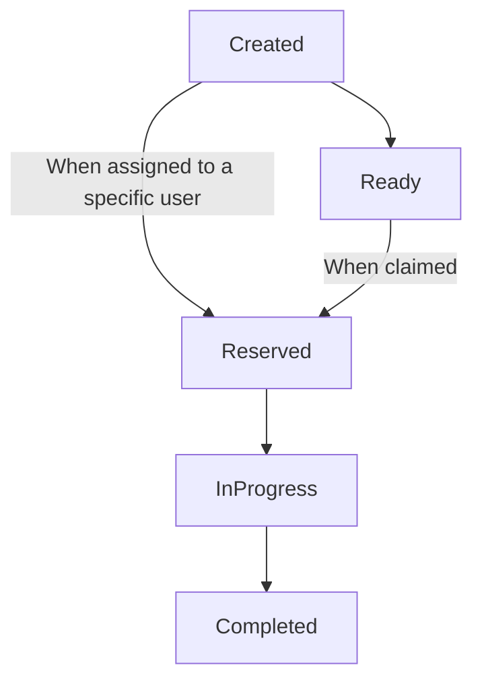

# Human Task Specification

## Table of Contents

- [Introduction](#introduction)
- [Specification](#specification)
  - [Core Concepts](#core-concepts)
    - [Human Task lifetime](#task-lifetime)
  - [Human Task Definitions](#human-task-definitions)
  - [Form Definitions](#form-definitions)
  - [Notification Definitions](#notification-definitions)
  - [Deadline Definitions](#deadline-definitions)
  - [Escalation Definitions](#escalation-definitions)
  - [Escalation action Definitions](#escalation-action-definitions)
    - [Notification](#notification-escalation-action-definitions)
    - [Reassignment](#reassignment-escalation-action-definitions)
    - [SubTask](#subtask-escalation-action-definitions)

## Introduction

### Core concepts

#### Task lifetime



## Human Task Definitions

### Description

Defines a human task and configures its behaviors.

### Properties

| Name | Type | Required | Runtime<br>Expression | Description |
|------|:----:|:--------:|:---------------------:|-------------|
| id | `string` | `yes` | `no` | A string that globally and uniquely identifies the human task definition. <br>*MUST be lowercase and must only contain alphanumeric characters, with the exception of the `.` and `-` characters. <br>It is recommended for the id to be automatically generated by implementations, following the `{namespace}.{name}:{version}` format.* |
| name | `string` | `yes` | `no` | The name of the human task definition. <br>*Must be lowercase and only contain alphanumeric characters, with the exceptions of the `-` character.** |
| namespace | `string` | `yes` | `no` | The namespace the human task definition belongs to. <br>*Must be lowercase and only contain alphanumeric characters, with the exceptions of the `-` and `.` characters.* |
| version | `string` | `yes` | `no` | The [semantic version](https://semver.org/) of the human task definition. <br>*Must be lowercased.* |
| specVersion | `string` | `yes` | `no` | The Human Task spec version to use. <br>*Defaults to the latest released spec version.* |
| expressionLanguage | `string` | `yes` | `no` | The language to use to evaluate [runtime expression](#runtime-expression)s.<br>*Defaults to [`jq`](https://stedolan.github.io/jq/).* |
| key | `string` | `no` | `yes` | A literal or a [runtime expression](#runtime-expression) used to generate the keys of instanciated human tasks. It could be used, in the case of a purchase review, to set the reviewed purchase order's id as the human task's key   |
| title | `object` | `no` | `yes` | The mappings of localized titles to their two-letter **ISO 639-1** language names. Titles are used as human task localized display name. |
| subject | `object` | `no` | `yes` | The mappings of localized subjects to their two-letter **ISO 639-1** language names. |
| description | `object` | `no` | `yes` | The mappings of localized descriptions to their two-letter **ISO 639-1** language names. |
| inputDataSchema | [`jsonSchema`](https://json-schema.org/) | `no` | `no` | A [`JSON Schema`](https://json-schema.org/) use to define and validate inputs of the human task definition's instances | 
| outputDataSchema | [`jsonSchema`](https://json-schema.org/) | `no` | `no` | A [`JSON Schema`](https://json-schema.org/) use to define and validate outputs of the human task definition's instances | 
| form | [`formDefinition`](#form-definition) | `yes` | `no` | Configures the task's form. |
| notifications | [`notification[]`](#notification-definition) | `no` | `no` | An array containing the human task's [`notifications`](#notification-definition) |
| deadlines | [`deadlineDefinition[]`](#deadline-definition) | `no` | `no` | An array containing the [`deadlines`](#deadline-definition) of the human task's instances |

**YAML example definition**

```yaml
id: openbank.loan-management.loan-approval-request:1.0.5
name: loan-approval-request
namespace: openbank.loan-management
version: '1.0.0'
specVersion: '0.1'
expressionLanguage: jq
key: '${ .case.reference }'
title:
  fr: Examiner reqûete de crédit
  en: Review loan request
subject:
  fr: Crédits à tempérament
  en: Installment credits
description:
  fr: Examiner une requête de crédit à tempérament
  en: Review an installment credit request 
inputDataSchema: https://foo-bank.com/schemas/humantasks/input.json
outputDataSchema: https://foo-bank.com/schemas/humantasks/output.json
form:
  data:
    schema: https://foo-bank.com/schemas/humantasks/form.data.json
  view: openbank.loan-management.forms.loan-approval-request:1.0.0
notifications:
  - name: task-pending-reminder
    view: openbank.loan-management.notifications.task-pending-reminder:1.0.0
    input: '${ .input }
    recipients:
      - user: alan
deadlines:
  - name: approve-before-48h
    type: start
    duration: P2D
    escalations:
      - name: reminder
        action:
          notification: task-pending-reminder
outcomes:
  - name: approved
    condition: '${ .output.approved and .output.approverId != null }'
  - name: rejected
```

### Form Definitions

#### Description

Represents the definition of an human task form, which is used to collect data from users.

*Example of a form with an inline view:*

```yaml
...
form:
  data:
    filter:
      input: '${ .input.client }'
    schema: 
      type: object
      properties:
        client:
          type: object
          properties:
            firstName:
              type: string
            lastName:
              type: string
            email:
              type: string
              format: email
          required:
            - firstName
            - lastName
            - email
  view:
    type: jsonform
    template: >
      {
        "type": "VerticalLayout",
        "elements": [
        {
          "type": "Label",
          "text": "Review new client profile"
        },
        {
          "type": "Control",
          "scope": "#/properties/client/properties/firstName"
        },
        {
          "type": "Control",
          "scope": "#/properties/client/properties/lastName"
        },
        {
          "type": "Control",
          "scope": "#/properties/client/properties/email"
        }]
      }
...
```

#### Properties

| Name | Type | Required | Runtime<br>Expression | Description |
|------|:----:|:--------:|:---------------------:|-------------|
| type | `string` | true | true | The view type.<br>*Defaults to [`md`](https://www.markdownguide.org/).*<br>*Can be a [runtime expression](#runtime-expression).* |
| template | `string` | true | true | The view template.<br>*Can be a (or contain) [runtime expression(s)](#runtime-expression).* |


### View Definitions

#### Description

Represents the definition of a view.

#### Properties

| Name | Type | Required | Runtime<br>Expression | Description |
|------|:----:|:--------:|:---------------------:|-------------|
| type | `string` | true | true | The view type.<br>*Defaults to [`md`](https://www.markdownguide.org/).*<br>*Can be a [runtime expression](#runtime-expression).* |
| template | `string` | true | true | The view template.<br>*Can be a (or contain) [runtime expression(s)](#runtime-expression).* |

### Notification Definitions

#### Description

Represents the definition of a notification, which is use to communicate the status of the task to users.

An example of such a notification would be a reminder to execute a start, which can be defined as follows:

```yaml
...
notifications:
  - name: execute-task-reminder
    view: openbank.loan-management.notifications.task-reminder:1.0.0
    input: '${ .input }
    recipients:
      - user: alan
...
```

An example of a notification using an inline view definition:

```yaml
...
notifications:
  - name: inline-execute-task-reminder
    view:
      type: md
      template: 'You have been assigned [a task](${ .context.task.uri }) that has not yet been performed.<br>Please address it as soon as possible.'
...
```

#### Properties

| Name | Type | Required | Runtime<br>Expression | Description |
|------|:----:|:--------:|:---------------------:|-------------|
| name | `string` | `yes` | `no` | The name used to reference the notification definition.<br>*Must be lowercase and only contain alphanumeric characters, with the exceptions of the `-` character.* |
| view | `string`<br>`viewDefinition` | `yes` | `yes` | Configures the notification's view.<br>*If a `string`, represents the unique identifier of the template to use, using the `{namespace}.{name}:{version}` format.<br>If a `viewDefinition`, configures the view inline.<br>*Can be a [runtime expression](#runtime-expression).* |
| input | `string`<br>`object` | `no` | `yes` | If a `string`, is a [runtime expression](#runtime-expression) used to build the notification's input data based on the human task's data.<br>If an `object`, represents the input data of the notification to produce. [runtime expression](#runtime-expression)s can be used in any and all properties, at whichever depth. 
| recipients | [`peopleAssignmentDefinition[]`](#people-assignment-definition) | `yes` | `no` | An array that contains the notification's recipients.<br>*Must contain at least one [recipient](#people-assignment-definition).*

### Deadline Definitions

#### Description

Represents the definition of a deadline to reach a given human task status milestone. 

For example, one might want to send a reminder notification if an important task has not started before 30 minutes.

The following sample demonstrates a deadline to achieve this:

```yaml
...
deadlines:
  - name: start-before-30m
    type: start
    duration: PT30M
    escalations:
      - name: reminder
        action:
          notification:
            refName: please-resolve-urgently
...
```

#### Properties

| Name | Type | Required | Runtime<br>Expression | Description |
|------|:----:|:--------:|:---------------------:|-------------|
| name | `string` | `yes` | `no` | The name of the deadline. <br />*Must be lowercase and only contain alphanumeric characters, with the exceptions of the `-` character.* |
| type | `enum` | `yes` | `no` | The deadline type.<br>*Possibles values are: `start` and `completion`* |
| until | `string` | `depends` | `no` | The **ISO 8601** date and time after which the deadline triggers the defined escalation.<br>*Is required if `duration` has not been set.* |
| duration | `dateTime` | `depends` | `no` | The **ISO 8601** duration after which the deadline triggers the defined escalation.<br>*Is required if `until` has not been set.* |
| escalations | [`escalationDefinition[]`](#escalation-definition) | `yes` | `no` | An array containing the escalations that may be performed when the deadline has been reached.<br>Must contain at least one escalation definition. |

### Escalation Definitions

#### Description

Represents the definition of an escalation that occurs if the human task has not reached a given status before a specific date and time, or before a given amount of time.

Example of an escalation that reassigns the task to Alan if the the task's amount is higher than 10,000.00:

```yaml
...
- name: reassign-to-alan
  condition: '${ .input.value > 10000 }'
  action:
    reassign:
      to: 
        user: alan
...
```

#### Properties

| Name | Type | Required | Runtime<br>Expression | Description |
|------|:----:|:--------:|:---------------------:|-------------|
| name | `string` | `yes` | `no` | The name of the escalation. <br />*Must be lowercase and only contain alphanumeric characters, with the exceptions of the `-` character.* |
| condition | `string` | `no` | `yes` | A [runtime expression](#runtime-expression) that determines whether or not the deadline applies.
| action | `escalationActionDefinition` | `yes` | `no` | Configures the [`escalation action`](#escalation-action-definition) to perform |

### Escalation Action Definitions

#### Description

Represents the definition of the action undertaken as the result of an escalation. 

There are 3 different types of escalation actions:

- [`notification`](#notification-escalation-action-definition): used to notify users about the status of the task.
- [`reassignment`](#reassignment-escalation-action-definition): used to reassign a task.
- [`subtask`](#subtask-escalation-action-definition): used to create a new subtask.

#### Properties

| Name | Type | Required | Runtime<br>Expression | Description |
|------|:----:|:--------:|:---------------------:|-------------|
| notification | [`notification`](#notification-effect-definition) | `depends` | `no` | Configures the [`notification`](#notification-effect-definition) to produce, in case `type` has been set to `notification`.<br>Required if `reassignment` and `subtask` have not been set, should otherwise be null. |
| reassignment | [`reassignment`](#reassignment-effect-definition) | `depends` | `no` | Configures the [`reassignment`](#reassignment-effect-definition) to perform, in case `type` has been set to `reassignment`.<br>Required if `notification` and `subtask` have not been set, should otherwise be null. |
| subTask | [`notification`](#notification-effect-definition) | `depends` | `no` | Configures the [`subTask`](#subtask-effect-definition) to create, in case `type` has been set to `subtask`.<br>Required if `notification` and `reassignment` have not been set, should otherwise be null. |

### Notification Escalation Action Definitions

#### Description

Sends a notification to a given list of recipients as the result of an elapsed deadline.

#### Properties

| Name | Type | Required | Runtime<br>Expression | Description |
|------|:----:|:--------:|:---------------------:|-------------|
| refName | `string` | `yes` | `no` | The name of the notification to produce |
| input | `string`<br>`object` | `no` | `yes` | If a `string`, is a [runtime expression](#runtime-expression) used to override the [`notification`](#notification-definition)'s input data based on the human task's data.<br>If an `object`, represents the input data of the notification to produce. [runtime expression](#runtime-expression)s can be used in any and all properties, at whichever depth. 
| recipients  | [`peopleAssignmentDefinition`](#people-assignment-definition) | `no` | `no` | An object used to override the referenced [`notification definition`](#notification-definition)'s [`recipients`](#people-assignment-definition) 

### Reassignment Escalation Action Definitions

#### Description

Configures a reassignment to perform as the result of an elapsed deadline.

#### Properties

| Name | Type | Required | Runtime<br>Expression | Description |
|------|:----:|:--------:|:---------------------:|-------------|
| to | `peopleSelectorDefinition` | `no` | `no` | Configures the people to reassign the task to.

### SubTask Escalation Action Definitions

#### Description

Configures a subtask to create as the result of an elapsed deadline.

#### Properties

| Name | Type | Required | Runtime<br>Expression | Description |
|------|:----:|:--------:|:---------------------:|-------------|
| refName | `string` | `yes` | `yes` | A literal or a [runtime expression](#runtime-expression) that references the [`subtask definition`](#subtask-definition) to create. |
| input | `string`<br>`object` | `no` | `yes` | If a `string`, is a [runtime expression](#runtime-expression) used to build the subtask's input data based on the human task's data.<br>If an `object`, represents the input data of the subtask to create. [runtime expression](#runtime-expression)s can be used in any and all properties, at whichever depth. 
| people  | [`peopleAssignmentDefinition`](#people-assignment-definition) | `no` | `no` | An object used to override the referenced [`subtask definition`](#subtask-definition)'s [`people assignment definitions`](#people-assignment-definition) |