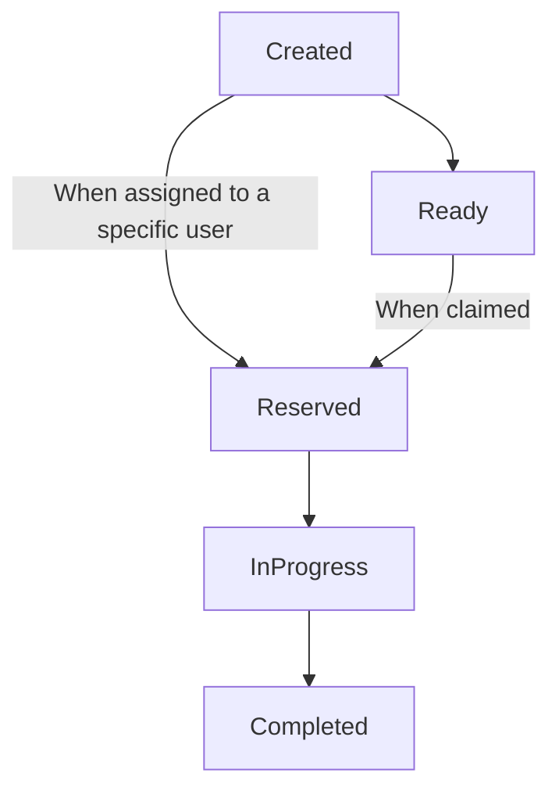

# Open Human Task Specification

## Table of Contents

- [Introduction](#introduction)
- [Specification](#specification)
  - [Core Concepts](#core-concepts)
    - [Generic Human Roles](#generic-human-roles)
      - [Potential initiators](#potential-initiators)
      - [Potential owners](#potential-owners)
      - [Excluded owners](#excluded-owners)
      - [Stakeholders](#stakeholders)
      - [Business Administrators](#business-administrators)
    - [Lifecycle](#lifecycle)
      - [Instanciation](#instanciation)
      - [Task Instance Statuses](#task-instance-statuses)
      - [Flow](#task-instance-flow)
    - [Runtime expressions](#runtime-expressions)
    - [Task Instance Data](#task-instance-data)
      - [Input Data](#input-data)
      - [Form Data](#form-data)
      - [Output Data](#output-data)
      - [Runtime Context Data](#runtime-context-data)
    - [Deadlines and Escalations](#deadlines-and-escalations)
    - [Notifications](#notifications)
  - [Implementation Guidelines](#implementation-guidelines)
    - [API](#api)
    - [Cloud Events](#cloud-events)
  - [Definitions](#definitions)
    - [Human Task Definitions](#human-task-definitions)
    - [People Assignments Definitions](#people-assignments-definitions)
    - [People Reference Definitions](#people-reference-definitions)
    - [Users Reference Definitions](#users-reference-definitions)
    - [Claim Filter Definitions](#claim-filter-definitions)
    - [Logical People Group Definitions](#logical-people-group-definitions)
    - [Form Definitions](#form-definitions)
    - [Data Model Definitions](#data-model-definitions)
    - [View Definitions](#view-definitions)
    - [Subtask Definitions](#subtask-definitions)
    - [Notification Definitions](#notification-definitions)
    - [Reassignment](#reassignment-definitions)
    - [Deadline Definitions](#deadline-definitions)
    - [Completion Behavior Definitions](#completion-behavior-definitions)
    - [Outcome Definitions](#outcome-definitions)
    - [Escalation Definitions](#escalation-definitions)
    - [Escalation Action Definitions](#escalation-action-definitions)
    - [Human Tasks](#human-tasks)
    - [People Assignments](#people-assignments)
    - [User References](#user-references)
    - [Task Definition References](#task-definition-references)
    - [Forms](#forms)
    - [Views](#views)
    - [Attachments](#attachments)
    - [Comments](#comments)

## Introduction

The present documents describes the Open Human Task specification, which is intended as a modernization of the (awesome) [WS-HumanTask Specification](http://docs.oasis-open.org/bpel4people/ws-humantask-1.1-spec-cs-01.html).

## Core concepts

### Generic Human Roles

Generic human roles define what a person or a group of people resulting from a people query can do with tasks and notifications. The following generic human roles are taken into account in this specification:

- [Potential initiators](#potential-initiators)
- [Initiator](#initiator)
- [Stakeholders](#stakeholers)
- [Potential owners](#potential-owners)
- [Actual owner](#actual-owner)
- [Excluded owners](#excluded-owners)
- [Business administrators](#business-administrators)
- [Notification recipients]()

#### Potential initiators

##### Description

Defines the potential initiators of the task.

***Remark(s)**: Implementations should allow users to instanciate the tasks they are the potential initiators of.*

##### Permissions

- [x] Instanciate task.
- [x] Patch input data *(only before task has been claimed)*.
- [x] Add attachment *(only before task has been claimed)*.
- [x] Add comment *(only before task has been claimed)*.

#### Initiator

##### Description

Represents the person that has initiated (instanciated) the task.

##### Permissions

- [x] Patch input data *(only before task has been claimed)*.
- [x] Change priority *(only before task has been claimed)*.
- [x] Add attachment *(only before task has been claimed)*.
- [x] Add comment *(only before task has been claimed)*.

#### Stakeholders

##### Description

Defines the people ultimately responsible for the oversight and outcome of the task. A task stakeholder can influence the progress of a task, for example, by adding ad-hoc attachments, forwarding the task, or simply observing the state changes of the task.  It is also allowed to perform administrative actions on the task instance and associated notification(s), such as resolving missed deadlines.

##### Permissions

- [x] Add/remove attachment.
- [x] Add comment.
- [x] Receive notifications.
- [x] Patch input/output data.
- [x] Forward task.
- [x] Revoke task.
- [x] Change priority.

#### Potential owners

##### Description

Defines the persons who receive the task so that they can claim and complete it. A potential owner becomes the actual owner of a task by explicitly claiming it. Before the task has been claimed, potential owners can influence the progress of the task, for example by changing the priority of the task, adding ad-hoc attachments or comments.

##### Permissions

- [x] Claim task.
- [x] Change priority *(only before task has been claimed)*.
- [x] Add attachment *(only before task has been claimed)*.
- [x] Add comment *(only before task has been claimed)*.

#### Actual owner

##### Description

An actual owner of a task is the person actually performing the task. When task is performed, the actual owner can execute actions, such as revoking the claim, forwarding the task, suspending and resuming the task execution or changing the priority of the task.

##### Permissions

- [x] Revoke task.
- [x] Skip task. 
- [x] Delegate/forward task.
- [x] Suspend task.
- [x] Resume task. 
- [x] Change priority.
- [x] Add attachment.
- [x] Add comment.

#### Excluded owners

##### Description

Defines the users that are excluded from performing (and otherwise know/do anything about) the task.

##### Permissions

None.

#### Business administrators

##### Description

Business administrators play the same role as task stakeholders but at task definition level. Therefore, business administrators can perform the exact same operations as task stakeholders. Business administrators can also observe the progress of notifications.

##### Permissions

- [x] Add/remove attachment.
- [x] Add comment.
- [x] Receive notifications.
- [x] Patch input/output data.
- [x] Forward task.
- [x] Revoke task.
- [x] Change priority.
- [x] Edit task definition.

#### Notification recipients

##### Description

Defines the people who receive notifications about the user task's status.

##### Permissions

- [x] Receive notifications.

### Lifecycle

#### Instanciation

Once created, a [human task definition](#human-task-definition) needs to be instanciated, which can be done in various ways:

- `Periodically`, by defining a [schedule](#schedule-definition), in which case the [task](#human-task-definition) will be instanciated at configured intervals.
- `Manually`, in which case the [task](#human-task-definition) is explicitly instanciated by a [potential initiator](#potential-initiators).
- `Asynchronously`, in which case the [task](#human-task-definition) is instanciated by a consumed [`HumanTaskCreationRequested` integration event](#human-task-creation-requested-integration-event).
- `Implicitly`, in which case the [task](#human-task-definition) is instanciated by another [task](#human-task-definition), for example as the result of an [escalation](#deadlines-and-escalations).  

#### Task instance statuses

| name | description |
|------|-------------|
| `created` | The [task](#human-tasks) has been created. <br>It should automatically move to the `ready` status, save if the [potential owners](#potential-owners) query did not resolve a single user.<br>In that case, a [business administrator](#business-administrator) of the task is expected to explicitly assign the [task](#human-tasks).|
| `ready` | The [task](#human-tasks) can be claimed by one of its [potential owners](#potential-owners).  |
| `reserved` | The [task](#human-tasks) is assigned to a single person or has been claimed by one of its [potential owners](#potential-owners).<br>The [actual owner](#actual-owner) of a [task](#human-tasks) can choose to release it and make it again available to its [potential owners](#potential-owners). |
| `running` | The [task](#human-tasks) has started and is in progress. |
| `completed` | The [task](#human-tasks) has been completed. |
| `obsolete` | The [task](#human-tasks) is obsolete and has been skipped. |

#### Task instance flow



### Runtime expressions

#### Description

The specification defines expressions that can be used to select, filter, alter and create task-related data based on the [operational context](#operational-context).

By convention, <ins>all runtime expressions should be expressed using the `${ expression }` format</ins>, even as values of properties that explicitly expect a runtime expression. 
This allows readers of an authored [definition](#human-task-definitions) to easily identify them.

Because of its countless features, we chose to use [`jq`](https://stedolan.github.io/jq/) as the spec's default runtime expression language, which by the way is a minimal requirement for implementations.

#### Examples

*Example of a [`jq`](https://stedolan.github.io/jq/) expression used to interpolate a greeting message with the [actual owner](#actual-owner)'s name:*

```yaml
Hello ${ $CONTEXT.peopleAssignments.actualOwner.name }! How are you today?
```

*Example of a [`jq`](https://stedolan.github.io/jq/) expression used to merge the task's input data and the form's data:*

```yaml
$CONTEXT.inputData + $CONTEXT.form.data
```

*Example of a [`jq`](https://stedolan.github.io/jq/) condition used to check if an hypothetical customer passed as the task's input is an adult:*
```yaml
${ (((now | todate)[0:4] | tonumber) - ($CONTEXT.inputData.customer.dateOfBirth[0:4] | tonumber)) >= 18 }
```

### Task Instance Data

Task instances have access to 3 types of data:

- [Input Data](#input-data): The task's input data.
- [Form Data](#form-data): The task's form data, filled by owners.
- [Output Data](#input-data): The task's output data.

The data is exposed to [runtime expressions](#runtime-expressions) by the [runtime context data](#runtime-context-data), using the `$CONTEXT` argument, which is described [here](#runtime-context-data).

#### Input Data

##### Introduction

The business data passed as the task's input. 

It may or may not be, partially or not, related to the data of the task's form submitted by users. Equally, it may or may not be, partially or not, related to the task's output data.

The data is validated against the [JsonSchema](https://json-schema.org/) specified as the `inputDataSchema` property of the [task's definition](#human-task-definitions), if any.

Note that the input data should be presented in a human-readable way (avoid machine formats such as `json`) to users performing the task. 

##### Examples

```yaml
client:
  id: 123
  firstName: Larry
  lastName: Queen
  dateOfBirth: '03/22/1969'
request:
  concerns: debit-card
  requestType: order
  parameters:
    originatesFrom:
      type: agency
      name: OpenBank Zimbabwe
      address: 69 Love Street, 1969 Harare, Zimbabwe
    deliverTo:
      type: agency
      name: OpenBank Zimbabwe
      address: 69 Love Street, 1969 Harare, Zimbabwe
    observations: none
```

#### Form Data

##### Introduction

Represents the form data submitted by task owners.

##### Examples

```yaml
requestReviewed: true
requestOutcome: accepted
confidenceRatio: 0.92
observations: None
```

#### Output Data

##### Introduction

The task's business data output.

The data is validated against the [JsonSchema](https://json-schema.org/) specified as the `outputDataSchema` property of the [task's definition](#human-task-definitions), if any.

##### Examples

```yaml
client:
  id: 123
  firstName: Larry
  lastName: Queen
  dateOfBirth: '03/22/1969'
request:
  createdAt: 02/02/2022, 14:55:51 +01:00
  concerns: debit-card
  requestType: order
  parameters:
    originatesFrom:
      type: agency
      name: OpenBank Zimbabwe
      address: 69 Love Street, 00000 Harare, Zimbabwe
    deliverTo:
      type: agency
      name: OpenBank Zimbabwe
      address: 69 Love Street, 00000 Harare, Zimbabwe
    observations: none
result:
  type: success
  status: inProgress
  scheduledDate: 02/07/2022
```

#### Runtime Context Data

##### Introduction

The `$CONTEXT` [runtime expression](#runtime-expressions) argument exposes operational data, such as both the task's input and output data, its form, its comments, its attachments, etc.

Note that exposed data is processed and arranged before making it available.

##### Properties

| Name | Type | Description | 
|------|:----:|-------------|
| id | `string` | The task instance's unique identifier. |
| key | `string` | The task instance's key. |
| definitionId | `string` | The unique identifier of the [task's definition](#human-task-definitions). |
| status | `enum` | The task instance's [status](#task-statuses). |
| priority | `number` | The task instance's priority. |
| title | `object` | The mappings of localized titles to their two-letter **ISO 639-1** language names. |
| subject | `object` | The mappings of localized subjects to their two-letter **ISO 639-1** language names. |
| description | `object` | The mappings of localized descriptions to their two-letter **ISO 639-1** language names. |
| peopleAssginments | [`peopleAssignments`](#people-assignments-definitions) | Describes the people related to the task and their assigned role(s). |
| inputData | `object` | The task instance's input data. |
| outputData | `object` | The task instance's output data. |
| form | [`form`](#forms) | The task's form. |
| comments | [`comment[]`](#comments) | An array containing the task's comments. |
| attachments | [`attachment`](#attachments) | An array containg the task's attachments. |

##### Examples

*For example, if a [task's definition](#human-task-definitions) declares a subject such as the following:*

```yaml
...
subject:
  en: 'OpenBank Memo - ${ $CONTEXT.inputData.department.name.en } Department'
...
```

*... and if it is instanciated with an input data such as the following:*

```yaml
department:
  id: 123
  name:
    en: 'Credits and Loans'
```

*The following data would be made available in the `$CONTEXT` argument:*

```yaml
...
subject:
  en: 'OpenBank Memo - Credits and Loans Department'
...
```

*Example of a [jq](https://stedolan.github.io/jq/) condition that checks whether or not the task's instance's `priority` is higher than or equals 10:*

```jq
$CONTEXT.priority >= 10
```

### Deadlines and escalations

[Deadlines](#deadline-definitions) define a point in time at which a human task must have reached a specific status. If it did not, a set of [action](#escalation-action-definitions) are performed as part of conditonal [escalations](#escalation-definitions).

There are two kind of [deadlines](#deadline-definitions):

- `start`: Specifies the time until the task has to start, i.e. it has to reach state `inProgress`. It is defined as either the period of time or the point in time until the task has to reach state `inProgress`. 
Since expressions are allowed, durations and deadlines can be calculated at runtime, which for example enables custom calendar integration. The time starts to be measured from the time at which the task enters the state `created`. If the task does not reach state `inProgress` by the deadline an [escalation action](#escalation-action-definitions) or a set of [escalation actions](#escalation-action-definitions) is performed. Once the task is started, the timer becomes obsolete.

- `completion`: Specifies the due time of the task. It is defined as either the period of time until the task gets due or the point in time when the task gets due. The time starts to be measured from the time at which the task enters the state Created. If the task does not reach one of the final states (`completed`, `failed`, `error`, `exited`, `obsolete`) by the deadline an [escalation action](#escalation-action-definitions) or a set of [escalation actions](#escalation-action-definitions) is performed.

When a [deadline](#deadline-definitions) is reached, its [escaltions](#escalation-definitions) are evaluated to determine whether or not they should be performed. If an [escalations](#escalation-definitions) matches, the [action](#escalation-action-definitions) it defines is performed.

There are 3 types of [escalation actions](#escalation-action-definitions):

- [`notification`](#notification-escalation-action-definitions): Creates a new instance of the specified [notification definition](#notification-definitions) and adds to the work item queue of the specified recipients.
- [`reassignment`](#reassignment-escalation-action-definitions): Reassigns the task to another person and/or group of people.
- [`subtask`](#subtask-escalation-action-definitions): Creates a new subtask as the result of the escalation.

An example deadline use case would be to notify the actual owner that the task is past due after 1 hours if it has not been completed. Here is how to do this:

```yaml
...
deadlines:
  - name: start-before-1h
    type: completion
    duration: PT1H
    escalations:
      - name: reminder
        action:
          notification:
            refName: please-resolve-urgently
...
```

### Notifications

[Notifications](#notification-definitions) are used to communicate the progress of a task to one or more recipients. 

Like [forms](#form-definitions), [notifications](#notification-definitions) define a [view](#view-definitions) that specifies how to render them.

## Implementations guidelines

*Coming soon...*

### API

*Coming soon...*

### Cloud Events

*Coming soon...*

## Definitions

### Human Task Definitions

#### Description

Defines a human task and configures its behaviors.

#### Properties

| Name | Type | Required | Runtime<br>Expression | Description |
|------|:----:|:--------:|:---------------------:|-------------|
| id | `string` | `yes` | `no` | A string that globally and uniquely identifies the human task definition. <br>*MUST be lowercase and must only contain alphanumeric characters, with the exception of the `.` and `-` characters. <br>It is recommended for the id to be automatically generated by implementations, following the `{namespace}.{name}:{version}` format.* |
| name | `string` | `yes` | `no` | The name of the human task definition. <br>*Must be lowercase and only contain alphanumeric characters, with the exceptions of the `-` character.** |
| namespace | `string` | `yes` | `no` | The namespace the human task definition belongs to. <br>*Must be lowercase and only contain alphanumeric characters, with the exceptions of the `-` and `.` characters.* |
| version | `string` | `yes` | `no` | The [semantic version](https://semver.org/) of the human task definition. |
| specVersion | `string` | `yes` | `no` | The Human Task spec version to use. <br>*Defaults to the latest released spec version.* |
| routingMode | `enum` | `yes` | `no` | The task's routing mode.<br>Possible values are: `none`, `sequential` and `parallel`.<br>If sets to `none`, the task's does not perform any routing.<br>If set to `sequential`, a new subtask will be created and assigned to the first resolved [potential owner](#potential-owners). The runtime waits for the subtask's completion, then assigns a new one to the next [potential owner](#potential-owners), and repeats those steps until all [potential owner](#potential-owners) have performed the task.<br>If set to `parallel`, a subtask is created for each and every [potential owner](#potential-owners). The resulting subtasks are performed by their [actual owner](#actual-owner) in parallel.<br>*Defaults to `none`.* |
| expressionLanguage | `string` | `yes` | `no` | The language to use to evaluate [runtime expression](#runtime-expression)s.<br>*Defaults to [`jq`](https://stedolan.github.io/jq/).* |
| key | `string` | `no` | `yes` | A literal or a [runtime expression](#runtime-expression) used to generate the keys of instanciated human tasks. It could be used, in the case of a purchase review, to set the reviewed purchase order's id as the human task's key   |
| title | `string`<br>`object` | `no` | `yes` | The task's localized titles. Titles are used as human task localized display name.<br>If a `string`, the culture-invariant title's value.<br>If an `object`, the mappings of localized titles to their two-letter ISO 639-1 language names.<br>*Supports [runtime expression](#runtime-expressions).* |
| subject | `string`<br>`object` | `no` | `yes` | The task's localized subjects.<br>If a `string`, the culture-invariant subject's value.<br>If an `object`, the mappings of localized subjects to their two-letter ISO 639-1 language names.<br>*Supports [runtime expression](#runtime-expressions).* |
| description | `string`<br>`object` | `no` | `yes` | The task's localized descriptions.<br>If a `string`, the culture-invariant description's value.<br>If an `object`, the mappings of localized descriptions to their two-letter ISO 639-1 language names.<br>*Supports [runtime expression](#runtime-expressions).* |
| peopleAssignments | [`peopleAssignmentsDefinition`](#people-assignments-definitions) | `no` | `no` | The configuration of the task's people assignments to generic roles. |
| inputData | [`dataModelDefinition`](#data-model-definitions) | `no` | `no` | A [`data model definition`](#data-model-definitions) use to define, validate and initialize the input of the human task definition's instances. | 
| outputData | [`dataModelDefinition`](#data-model-definitions) | `no` | `no` | A [`data model definition`](#data-model-definitions) use to define, validate and initialize the output of the human task definition's instances. | 
| form | `string`<br>[`formDefinition`](#form-definitions) | `no` | `no` | Configures the task's form.<br>*If a `string`, an uri referencing the external [form definition](#form-definition).*<br>*If an `object`, the inline configuration of the human task's [form definition](#form-definition).* |
| subtasks | [`subTaskDefinition[]`](#subtask-definitions) | `no` | `no` | An array containing the task's children task. |
| subtaskExecutionMode | `enum` | `depends` | `no` | Defines the way subtasks should be executed.<br>Possible values are: `sequential` and `parallel`.<br>If set to `sequential`, [subtasks](#subtask-definitions) are executed in lexical order.<br>If set to `parallel`, [subtasks](#subtask-definitions) are executed in parallel.<br>*Required if at least one [subtask](#subtask-definitions) has been defined.*<br>*Defaults to `sequential`.* |
| deadlines | [`deadlineDefinition[]`](#deadline-definitions) | `no` | `no` | An array containing the [`deadlines`](#deadline-definitions) of the human task's instances. |
| completionBehaviors | [`completionBehaviorDefinition[]`](#completion-behavior-definitions) | `no` | `no` | An array that contains the task's [completion behaviors](#completion-behavior-definitions).<br>*Required if `routingMode` has not been set to `none`, or if the task defines `subtasks`. Otherwise optional.* |
| outcomes | [`outcomeDefinition[]`](#outcome-definitions) | `no` | `no` | An array containing the task's possible [outcomes](#outcome-definitions). |
| annotations | `array`<br>`object` | `depends` | `no` | An array of string-based key/value pairs containing helpful terms used to describe the human task intended purpose, subject areas, or other important qualities.
| metadata | `object` | `no` | `no` | An object used to provide additional unstructured information about the human task definition. May be used by implementations to define additional functionality. | 

#### Examples

```yaml
id: openbank.loan-management.loan-approval-request:1.0.5
name: loan-approval-request
namespace: openbank.loan-management
version: '1.0.0'
specVersion: '0.1'
expressionLanguage: jq
key: '${ .case.reference }'
title:
  fr: Examiner requête de crédit
  en: Review loan request
subject:
  fr: Crédits à tempérament
  en: Installment credits
description:
  fr: Examiner une requête de crédit à tempérament
  en: Review an installment credit request 
inputData:
  schema: https://foo-bank.com/schemas/humantasks/input.json
outputData:
  schema: https://foo-bank.com/schemas/humantasks/output.json
form:
  data:
    schema: https://foo-bank.com/schemas/humantasks/form.data.json
  view: openbank.loan-management.forms.loan-approval-request:1.0.0
notifications:
  - name: task-pending-reminder
    view: openbank.loan-management.notifications.task-pending-reminder:1.0.0
    input: '${ .input }'
    recipients:
      - user: alan
deadlines:
  - name: approve-before-48h
    type: start
    duration: P2D
    escalations:
      - name: reminder
        action:
          notification: task-pending-reminder
outcomes:
  - name: approved
    condition: '${ .output.approved and .output.approverId != null }'
    value: Approved
  - name: rejected
    value: 
      en: Approved
      fr: Approuvé
annotations:
  tags: loan approval
metadata:
  x-obms-css-lib: adminkit
```

### People Assignments Definitions

#### Description

Represents the definition used to configure people assignments for instance of the human task definition.

#### Properties

| Name | Type | Required | Runtime<br>Expression | Description |
|------|:----:|:--------:|:---------------------:|-------------|
| [potentialOwners](#potential-owners) | [`peopleReferenceDefinition[]`](#people-reference-definitions) | `no` | `no` | The [potential owners](#potential-owners) of the task. |
| [excludedOwners](#excluded-owners) | [`peopleReferenceDefinition[]`](#people-reference-definitions) | `no` | `no` | The [excluded owners](#excluded-owners) of the task. |
| [potentialTaskInitiators](#potential-task-initiators) | [`peopleReferenceDefinition[]`](#people-reference-definitions) | `no` | `no` | The [potential initiators](#potential-task-initiators) of the task. |
| [taskStakeholders](#stakeholders) | [`peopleReferenceDefinition[]`](#people-reference-definitions) | `no` | `no` | The [stakeholders](#stakeholders) of the task. |
| [businessAdministrators](#businessAdministrators) | [`peopleReferenceDefinition[]`](#people-reference-definitions) | `no` | `no` | The [business administrators](#business-administrators) of the task. |
| [notificationRecipents](#notification-recipents) | [`peopleReferenceDefinition[]`](#people-reference-definitions) | `no` | `no` | The [recipients of all notifications](#notification-recipents) produced by the task. |
| groups | [`logicalPeopleGroupDefinition[]`](#logical-people-group-definitions) | `no` | `no` | An array containing the [`logical people groups`](#logical-people-group-definition) defined for the task's scope. |

#### Examples

```yaml
...
peopleAssignments:
  potentialOwners:
    - user: alan
...
```

### People Reference Definitions

#### Description

Represents an object used to reference a user or a group of users based on given parameters.

#### Properties

| Name | Type | Required | Runtime<br>Expression | Description |
|------|:----:|:--------:|:---------------------:|-------------|
| user | `string` | `depends` | `yes` | References the user with the specified id, as defined by the JWT `sub` claim.<br>*Required if `users` has not been set.* |
| users | [`usersReferenceDefinition`](#users-reference-definitions) | `depends`| `no` | References multiple users that match the defined filters.<br>*Required if `user` has not been set.* |

#### Examples

*Example of a definition referencing a single person by id:*

```yaml
...
- user: alan
...
```

*Example of a definition referencing anyone that has a claim of type `task:perform` as well as a claim of type `division-role` with the value equal to `clerk`:*

```yaml
...
- users:
    withClaims:
      - type: 'task:perform'
      - type: division-role
        value: clerk
...
```

### Users Reference Definitions

#### Description

Represents an object used to reference multiple users based on given parameters.

#### Properties

| Name | Type | Required | Runtime<br>Expression | Description |
|------|:----:|:--------:|:---------------------:|-------------|
| withClaims | [`claimFilterDefinition[]`](#claim-filter-definitions) | `depends` | `no` | The claims to filter by the users to reference.<br>Required if `inGroup` and `inGenericRole` have not been set, otherwise ignored. |
| inGroup | `string` | `depends` | `yes` | The logical group that defines the users to reference.<br>Required if `withClaims` and `inGenericRole` have not been set, otherwise ignored. |
| [inGenericRole](#generic-human-roles) | `enum` | `depends` | `no` | The [generic role](#generic-human-roles) that defines the users to reference.<br>Required if `withClaims` and `inGroup` have not been set, otherwise ignored.<br>*Assignments of users to generic roles are delcared in the [human task definition's `peopleAssignments`](#human-task-definitions) property.*  |

#### Examples

*Example of a definition referencing users that match the specified [claim filters](#claim-filter-definitions):*

```yaml
...
- users:
    withClaims:
      - type: 'task:perform'
      - type: division-role
        value: clerk
...
```

*Example of a definition referencing the task's business administrators:*

```yaml
...
- users:
    inGenericRole: businessAdministrator
...
```

*Example of a definition referencing the people in the regional clerk group:*

```yaml
...
- users:
    inGroup: regional-clerks
...
```

### Claim Filter Definitions

#### Description

Defines a logical group of people which can be referenced in the task's scope.

#### Properties

| Name | Type | Required | Runtime<br>Expression | Description |
|------|:----:|:--------:|:---------------------:|-------------|
| type | `string` | `depends` | `yes` | The type of the claim matching users must own.<br>*Required if `value` has not been set.*<br>*If used in conjunction with the `value` property, filters users that have a claim of the specified type, with the specified value.*<br>*Supports [runtime expressions](#runtime-expressions).<br>Supports [regular expressions](https://www.regular-expressions.info/).* |
| value | `string` | `depends` | `yes` | Specifies a claim value matching users must own.<br>*Required if `type` has not been set.*<br>*If the `type` property has not been set, filters users that have a claim of any type containing the specified value.*<br>*Supports [runtime expressions](#runtime-expressions).<br>Supports [regular expressions](https://www.regular-expressions.info/).*

#### Examples

*Example of a claim filter definition that matches users that own at least one claim of type `task:perform`:*
```yaml
...
- type: 'task:perform'
...
```

*Example of a claim filter definition that matches users that own at least one claim that contains the value `/openbank/departments/credits`:*
```yaml
...
- value: '/openbank/departments/credits'
...
```

*Example of a claim filter definition that matches users that own at least one claim matching the [`regex pattern`](https://www.regular-expressions.info/) `^\/openbank\/departments\/credits\/`:*
```yaml
...
- value: '^\/openbank\/departments\/credits\/'
...
```

*Example of a claim filter definition that matches users that own at least one claim of type `openbank:department` with a value matching the [`regex pattern`](https://www.regular-expressions.info/) `^\/openbank\/departments\/credits\/`:*
```yaml
...
- type: openbank:department
  value: '^\/openbank\/departments\/credits\/'
...
```

### Logical People Group Definitions

#### Description

Defines a logical group of people which can be referenced in the task's scope.

#### Properties

| Name | Type | Required | Runtime<br>Expression | Description |
|------|:----:|:--------:|:---------------------:|-------------|
| name | `string` | `yes` | `no` | The name used to referenced the group in the task's scope.<br>*Must be lowercase and only contain alphanumeric characters, with the exceptions of the `-` character.* |
| members | [peopleReferenceDefinition[]](#people-reference-definitions) | `yes` | `no` | An array containing the [people references](#people-reference-definitions) used to define the users belonging to the group.<br>*Must contain at least one [people reference](#people-reference-definitions).*|

#### Examples

```yaml
...
peopleAssignments:
  groups:
    - name: regionalClerks
      members:
        - user: alan
...
```

### Form Definitions

#### Description

Represents the definition of an human task form, which is used to collect data from users.

#### Properties

| Name | Type | Required | Runtime<br>Expression | Description |
|------|:----:|:--------:|:---------------------:|-------------|
| data | [`dataModelDefinition`](#data-model-definitions) | `no` | `no` | Configures the form's data. |
| views | [`viewDefinition[]`](#view-definitions) | `yes` | `no` | Configures the form's views.<br>*Must contain at least one [`view definition`](#view-definitions).* |

#### Examples

*Example of a form with an inline view:*

```yaml
...
form:
  data:
    state: '${ .input.client }'
    schema: 
      type: object
      properties:
        client:
          type: object
          properties:
            firstName:
              type: string
            lastName:
              type: string
            email:
              type: string
              format: email
          required:
            - firstName
            - lastName
            - email
  view:
    type: jsonform
    renderingMode: process
    template: >
      {
        "type": "VerticalLayout",
        "elements": [
        {
          "type": "Label",
          "text": "Review new client profile"
        },
        {
          "type": "Control",
          "scope": "#/properties/client/properties/firstName"
        },
        {
          "type": "Control",
          "scope": "#/properties/client/properties/lastName"
        },
        {
          "type": "Control",
          "scope": "#/properties/client/properties/email"
        }]
      }
...
```

### Data Model Definitions

#### Description

Defines, describes and validates a data model.

#### Properties

| Name | Type | Required | Runtime<br>Expression | Description |
|------|:----:|:--------:|:---------------------:|-------------|
| schema | [`jsonSchema`](https://json-schema.org/) | `no` | `no` | The [`JsonSchema`](https://json-schema.org/) used to validate the model's data. |
| state | `string`<br>`object` | `no` | `no` | The model's initial state.<br>If a `string` , is a runtime expression used to build the model's initial state based on the human task's data.<br>If an `object`, represents the initial state of the model to create.  [Runtime expressions](#runtime-expressions) can be used in any and all properties, at whichever depth.<br>If not set, the initial state is empty. |

#### Examples

```yaml
data:
  state: '${ .input.client }'
  schema: 
    type: object
    properties:
      client:
        type: object
        properties:
          firstName:
            type: string
          lastName:
            type: string
          email:
            type: string
            format: email
        required:
          - firstName
          - lastName
          - email
```

### View Definitions

#### Description

Represents the definition of a view.

Views can be rendered using different modes. Note that multiple modes can be combined in a comma-separated way (ex: "process, render").

- `process`: Default rendering mode. The raw template is pre-processed in search of runtime expressions it interpolates after evaluation.
- `render`: The template should is pre-rendered by the server before being served to consumers.
- `none`: The template is not processed nor rendered, and is given as such to consumers.

#### Properties

| Name | Type | Required | Runtime<br>Expression | Description |
|------|:----:|:--------:|:---------------------:|-------------|
| type | `string` | `yes` | `yes` | The view type.<br>*Defaults to [`gfm`(GitHub Flavored Markdown)](https://github.github.com/gfm/).*<br>*Can be a [runtime expression](#runtime-expression).* |
| renderingMode | `enum` | `yes` | `no` | Defaults to `process`. Indicates the way the view should be rendered.<br>Possible values are: `process`, `render` and `none`. |
| template | `string`<br>`object` | `yes` | `yes` | The view template.<br>*If a `string`, the raw template contents.*<br>*If an `object`, the inline template.*<br>*Can be a (or contain) [runtime expression(s)](#runtime-expression).* |

#### Examples

*Example of a view definition using a raw template (`string`):*

```yaml
  view:
    type: jsonform
    renderingMode: process
    template: >
      {
        "type": "VerticalLayout",
        "elements": [
        {
          "type": "Label",
          "text": "Review new client profile"
        },
        {
          "type": "Control",
          "scope": "#/properties/client/properties/firstName"
        },
        {
          "type": "Control",
          "scope": "#/properties/client/properties/lastName"
        },
        {
          "type": "Control",
          "scope": "#/properties/client/properties/email"
        }]
      }
```

*Example of the same view definition, using an inline template (`object`):*

```yaml
...
  view:
    type: jsonform
    renderingMode: process
    template:
      type: VerticalLayout
      elements:
      - type: Label
        text: Review new client profile
      - type: Control
        scope: "#/properties/client/properties/firstName"
      - type: Control
        scope: "#/properties/client/properties/lastName"
      - type: Control
        scope: "#/properties/client/properties/email"
...
```

### Subtask Definitions

#### Description

Represents the object that defines a configures the sub tasks of a [human task](#human-tasks).

#### Properties

| Name | Type | Required | Runtime<br>Expression | Description |
|------|:----:|:--------:|:---------------------:|-------------|
| name | `string` | `yes` | `no` | The subtask's name.<br>*Must be lowercase and only contain alphanumeric characters, with the exceptions of the `-` character.* |
| task | `string`<br>[`taskDefinitionReference`](#task-definition-references) | `yes` | `yes` | References the [human task definition](#human-task-definitions) to instanciate.<br>*If a `string`, the globally unique identifier of the [task definition](#human-task-definitions) to instanciate.*<br>If an `object`, the inline [task definition reference](#task-definition-references). |
| input | `string`<br>`object` | `no` | `yes` | The data to pass as the [subtask](#human-tasks)'s input.<br>If a `string` , is a runtime expression used to build the subtask's input data based on the human task's data.<br>If an `object`, represents the input data of the subtask to create. runtime expressions can be used in any and all properties, at whichever depth.<br>If not set, no input data is supplied to the [subtask](#human-task-definitions). |
| peopleAssignments | [peopleAssignments](#people-assignments-definitions) | `no` | `yes` | Configures the people to assign the [subtask](#human-task) to.<br>*Overrides the [assignments](#people-assignments-definitions) configured by the [subtask's definition](#human-task-definitions).* |

#### Examples

*Configures a subtask using the `openmoviedb.provide-movie-feedback:1.0.2` [definition](#human-task-definition), with the [input data](#input-data)'s `movieToRate` property value, and assigning it to Patrice Janssens.*
```yaml
name: collect-movie-feedback
taskRef: openmoviedb.provide-movie-feedback:1.0.2
input: ${ .inputData.movieToRate }
peopleAssignments:
  potentialOwners:
    - user:
        id: 69
        name: Patrice Janssens
```

### Notification Definitions

#### Description

Represents the definition of a notification, which is use to communicate the status of the task to users.

#### Properties

| Name | Type | Required | Runtime<br>Expression | Description |
|------|:----:|:--------:|:---------------------:|-------------|
| name | `string` | `yes` | `no` | The notification's name.<br>*Must be lowercase and only contain alphanumeric characters, with the exceptions of the `-` character.* |
| views | [`viewDefinition[]`](#view-definitions) | `yes` | `yes` | Configures the notification's views.<br>*Must contain at least one [`view definition`](#view-definitions).* |
| input | `string`<br>`object` | `no` | `yes` | If a `string`, is a [runtime expression](#runtime-expression) used to build the notification's input data based on the human task's data.<br>If an `object`, represents the input data of the notification to produce. [runtime expression](#runtime-expression)s can be used in any and all properties, at whichever depth. 
| recipients | [`peopleAssignmentDefinition[]`](#people-assignment-definition) | `no` | `no` | An array that contains the notification's recipients.<br>*If set, must contain at least one [recipient](#people-assignment-definition).*

#### Examples

*An example of such a notification would be a reminder to execute a start, which can be defined as follows:*

```yaml
...
notifications:
  - name: execute-task-reminder
    view: openbank.loan-management.notifications.task-reminder:1.0.0
    input: '${ .input }'
    recipients:
      - user: alan
...
```

*An example of a notification using an inline view definition:*

```yaml
...
notifications:
  - name: inline-execute-task-reminder
    view:
      type: md
      template: 'You have been assigned [a task](${ .context.task.uri }) that has not yet been performed.<br>Please address it as soon as possible.'
...
```

### Reassignment Definitions

#### Description

Configures a task reassignment.

#### Properties

| Name | Type | Required | Runtime<br>Expression | Description |
|------|:----:|:--------:|:---------------------:|-------------|
| to | `peopleSelectorDefinition` | `no` | `no` | Configures the people to reassign the task to.

#### Examples

```yaml
...
reassign:
  to: 
    user: alan
...
```

### Deadline Definitions

#### Description

Represents the definition of a deadline to reach a given human task status milestone. 

#### Properties

| Name | Type | Required | Runtime<br>Expression | Description |
|------|:----:|:--------:|:---------------------:|-------------|
| name | `string` | `yes` | `no` | The name of the deadline. <br />*Must be lowercase and only contain alphanumeric characters, with the exceptions of the `-` character.* |
| type | `enum` | `yes` | `no` | The deadline type.<br>*Possibles values are: `start` and `completion`* |
| elapsesAt | `dateTimeOffset` | `depends` | `no` | The **ISO 8601** date and time at which the deadline elaspes and potentially triggers escalations.<br>*Required if `duration` has not been set.* |
| elapsesAfter | `string` | `depends` | `no` | The **ISO 8601** duration after which the deadline elapses and potentially triggers escalations.<br>*Required if `until` has not been set.* |
| escalations | [`escalationDefinition[]`](#escalation-definition) | `yes` | `no` | An array containing the escalations that may be performed when the deadline has been reached.<br>Must contain at least one escalation definition. |

#### Examples

*For example, one might want to send a reminder notification if an important task has not started before 30 minutes.*

*The following sample demonstrates a deadline to achieve this:*

```yaml
...
deadlines:
  - name: start-before-30m
    type: start
    duration: PT30M
    escalations:
      - name: reminder
        action:
          notification:
            refName: please-resolve-urgently
...
```

### Escalation Definitions

#### Description

Represents the definition of an escalation that occurs if the human task has not reached a given status before a specific date and time, or before a given amount of time.

#### Properties

| Name | Type | Required | Runtime<br>Expression | Description |
|------|:----:|:--------:|:---------------------:|-------------|
| name | `string` | `yes` | `no` | The name of the escalation. <br />*Must be lowercase and only contain alphanumeric characters, with the exceptions of the `-` character.* |
| condition | `string` | `no` | `yes` | A [runtime expression](#runtime-expression) that determines whether or not the deadline applies.
| action | `escalationActionDefinition` | `yes` | `no` | Configures the [`escalation action`](#escalation-action-definition) to perform |

#### Examples

*Example of an escalation that reassigns the task to Alan if the the task's amount is higher than 10,000.00:*

```yaml
...
deadlines:
  - name: start-before-30m
    type: start
    duration: PT30M
    escalations:
      - name: reassign-to-alan
        condition: '${ .input.value > 10000 }'
        action:
          reassign:
            to: 
              user: alan
...
```

### Escalation Action Definitions

#### Description

Represents the definition of the action undertaken as the result of an escalation. 

There are 3 different types of escalation actions:

- [`notification`](#notification-definition): used to notify users about the status of the task.
- [`reassignment`](#reassignment-definition): used to reassign a task.
- [`subtask`](#subtask-definition): used to create a new subtask.

#### Properties

| Name | Type | Required | Runtime<br>Expression | Description |
|------|:----:|:--------:|:---------------------:|-------------|
| notification | [`notification`](#notification-definition) | `depends` | `no` | Configures the [`notification`](#notification-definition) to produce, in case `type` has been set to `notification`.<br>Required if `reassignment` and `subtask` have not been set, should otherwise be null. |
| reassignment | [`reassignment`](#reassignment-definition) | `depends` | `no` | Configures the [`reassignment`](#reassignment-definition) to perform, in case `type` has been set to `reassignment`.<br>Required if `notification` and `subtask` have not been set, should otherwise be null. |
| subTask | [`subtask`](#subtask-definition) | `depends` | `no` | Configures the [`subTask`](#subtask-definition) to create, in case `type` has been set to `subtask`.<br>Required if `notification` and `reassignment` have not been set, should otherwise be null. |

### Completion Behavior Definitions

#### Description

Defines the completion behavior of a task by configuring how to build the task's output based on specified conditions.

Completion behavior may or may not define a `condition` [runtime expression](#runtime-expressions) used to determine whether or not the completion behavior applies.

If no `condition` is defined, the [completion-behavior](#completion-behavior-definitions) is considered the task's default. There can be at most one default [completion-behavior](#completion-behavior-definitions) defined per task.

#### Properties

| Name | Type | Required | Runtime<br>Expression | Description |
|------|:----:|:--------:|:---------------------:|-------------|
| name | `string` | `yes` | `no` | The name of the completion behavior. <br>*Must be lowercase and only contain alphanumeric characters, with the exceptions of the `-` character.* |
| type | `enum` | `yes` | `no` | The completion behavior's type.<br>Possibles values are `automatic` and `manual`.<br>*If set to `automatic`, the task completes a soon as the `condition` matches.*<br>*If set the `manual`, the task must be explicitly completed by the actual owner whern the condition matches.*<br>*Defaults to `automatic`.* |
| condition | `string` | `no` | `yes` | A [runtime expression](#runtime-expressions) used to determine whether or not the completion behavior applies.<br>If null or whitespace, the completion behavior is considered the task's default. There must be at most one default [completion behavior](#completion-behavior-definitions). |
| output | `string`<br>`object` | `no` | `yes` | A `string` or `object` used to determine the task's output.<br>If a `string` , is a [runtime expression](#runtime-expressions) used to build the task's output data based on the human task's data.<br>If an `object`, represents the task's output data. [Runtime expression](#runtime-expressions) can be used in any and all properties, at whichever depth.<br>If not set, no input data is supplied to the [subtask](#human-task-definitions). |

#### Examples

*Example of a default and a conditional completion behaviors that set different task outputs:*
```yaml
completionBehaviors:
  - name: rated-behavior
    type: automatic
    condition: '${ $CONTEXT.form.data.rated }'
    output:
      movie: '${ $CONTEXT.inputData.movie }'
      feedback:
        seen: true
        rating: '${ $CONTEXT.form.data.rating }'
  - name: not-rated-behavior
    type: automatic
    output:
      movie: '${ $CONTEXT.inputData.movie }'
      feedback: 
        seen: '${ $CONTEXT.form.data.hasSeenMovie }' 
        comment: '${ $CONTEXT.form.data.comment }'
```

### Outcome Definitions

#### Description

Defines the outcome of a task.

An outcome can be the task's `default` (fallback), by leaving the `condition` property unset or setting it to `null`. 

A `default` outcome will <u>always</u> apply if its the only declared outcome, or if no conditional outcome matched the context.

#### Properties

| Name | Type | Required | Runtime<br>Expression | Description |
|------|:----:|:--------:|:---------------------:|-------------|
| name | `string` | `yes` | `no` | The name of the outcome. <br>*Must be lowercase and only contain alphanumeric characters, with the exceptions of the `-` character.* |
| condition | `string` | `no` | `yes` | A [runtime expression](#runtime-expression) used to determine whether or not the outcome applies.<br>*If not set, makes the outcome the task's default.*<br>*There can be at most one default outcome.* |
| value | `string`<br>`object` | `yes` | `yes` | The outcome's localized values.<br>If a `string`, the culture-invariant outcome's value.<br>If an `object`, the mappings of localized values to their two-letter ISO 639-1 language names.*Must declare at least one language/value pair.* |

#### Examples

```yaml
...
outcomes:
  - name: approved
    condition: ${ $CONTEXT.form.data.approved }
    value:
      en: Document Approved 
      pt: Documento Approvado
  - name: rejected
    value: Rejected
...
```

### Human Tasks

#### Description

Represents an instance of a [human task definition](#human-task-definitions).

#### Properties

| Name | Type | Required | Runtime<br>Expression | Description |
|------|:----:|:--------:|:---------------------:|-------------|
| id | `string` | `yes` | `no` | A string that globally and uniquely identifies the human task. <br>*MUST be lowercase and must only contain alphanumeric characters, with the exception of the `.` and `-` characters. <br>It is recommended for the id to be automatically generated by implementations, following the `{humanTaskDefinitionId}.{key}` format.* |
| key | `string` | `yes` | `no` | A string that uniquely identifies the human task amongst other instances of the same definition.<br>The `key` is a unique business identifier of the task, and should therefore ideally correspond to a relevant data in the task's context. For example, in an order review task, the key could be the id of the order to review.<br>Automatically generated by the [definition's](#human-task-definitions) `key` property, if any, or a magic string such as an UUID.<br>The generated key can be overriden when creating a new instance of an [human task definition's](#human-task-definitions), which can be used to correlate the task's cloud events in an async scenario.<br>*The key must be unique amongst instances of a specific human task definition.* |
| createdAt | `dateTimeOffset` | `yes` | `no` | The **ISO 8601** date and time at which the user task has been created |
| status | `enum` | `yes` | `no` | The status of the task.<br>Possibles values are `created`, `ready`, `reserved`, `inProgress`, `completed`, `obsolete` |
| peopleAssignments | [`peopleAssignment[]`](#people-assignments) | `yes` | `no` | The processed [people assignments definition](#people-assignments-definitions) containing the resolved users and their assignations. |
| inputData | `object` | `no` | `no` | The input data the task has been instanciated with. |
| form | [`form`](#form) | `yes` | `no` | The task's form. |
| attachments | [`attachment[]`](#attachments) | `no` | `no` | The task's attachments. |
| comments | [`comment[]`](#comments) | `no` | `no` | The task's comments. |

#### Examples

```yaml
id: 'openbank.loan-management.loan-approval-request:1.0.5-1236547890'
key: 1236547890
createdAt: '2008-09-22T14:01:54.9571247Z+00:00'
status: created
peopleAssignments:
  peopleAssignments:
    potentialOwners:
        - user:
            id: 69
            name: Alan Devito
        - user:
            id: 6969
            name: Sheniqua Johnson
input:
  client:
    firstName: Karen
    lastName: March
    nationality: USA
    dateOfBirth: 08/15/1985
  request:
    type: credit
    creditType: installment
    submittedAt: '2009-04-22T13:07:04.9185657Z+02:00'
    amount: 120,000.00
    currency: 
      code: USD
      symbol: $
    motive:
      other: Renovate pool house
    broker:
      type: in-house
      identity:
        id: 522
        name: Jason Smith
form:
  data:
    requestReviewed: false
  views:
    - type: jsonform
      status: rendered
      template: ...
attachments:
  - id: 2301
    createdAt: '2009-04-22T13:07:04.9185657Z+02:00'
    name: 
      contentType: application/pdf
      uri: https://test.com/downloads/resources/2301/raw    
    author:
      id: 522
      name: Jason Smith 
comments:
  - id: 65487
    createdAt: '2009-04-22T13:07:04.9185657Z+02:00'
    author:
      id: 522
      name: Jason Smith
    content: >
      The client has a spotless record, and due diligence demonstrates that she has solid assets, and a substancial reserve of cash.
```

### People Assignments

#### Description

Represents a processed [people assignments definition](#people-assignments-definitions) containing the resolved users and their assignations.

#### Properties

| Name | Type | Required | Runtime<br>Expression | Description |
|------|:----:|:--------:|:---------------------:|-------------|
| initiator | [`userReference`](#user-references) | `yes` | `no` | A [user reference](#user-references) that describes the task's initiator |
| [potentialOwners](#potential-owners) | [`userReference[]`](#user-references) | `no` | `no` | The resolved [potential owners](#potential-owners) of the task. |
| initiator | [`userReference`](#user-references) | `yes` | `no` | A [user reference](#user-references) that describes the task's initiator |
| [excludedOwners](#excluded-owners) | [`userReference[]`](#user-references) | `no` | `no` | The resolved [excluded owners](#excluded-owners) of the task. |
| [potentialInitiators](#potential-task-initiators) | [`userReference[]`](#user-references) | `no` | `no` | The resolved [potential initiators](#potential-task-initiators) of the task. |
| actualOwner | [`userReference`](#user-references) | `no` | `no` | A [user reference](#user-references) that describes the actual owner of the task. |
| [stakeholders](#stakeholders) | [`userReference[]`](#user-references) | `no` | `no` | The resolved [stakeholders](#stakeholders) of the task. |
| [businessAdministrators](#businessAdministrators) | [`userReference[]`](#user-references) | `no` | `no` | The resolved [business administrators](#business-administrators) of the task. |
| [notificationRecipents](#notification-recipents) | [`userReference[]`](#user-references) | `no` | `no` | The resolved [recipients of all notifications](#notification-recipents) produced by the task. |
| groups | [`logicalPeopleGroup[]`](#logical-people-groups) | `no` | `no` | An array containing the resolved [`logical people groups`](#logical-people-groups) defined for the task's scope. |

#### Examples

```yaml
...
potentialOwners:
  - id: 69
    name: Dawn West
  - id: 98
    name: Elliot Van Dries
stakeholders:
  - id: 2
    name: Dick Remy
...
```

### User References

#### Description

Represents a reference to an user.

#### Properties

| Name | Type | Required | Runtime<br>Expression | Description |
|------|:----:|:--------:|:---------------------:|-------------|
| id | `string` | `yes` | `no` | The user's unique identifier, as specified by its `sub` JWT claim type. |
| name | `string` | `no` | `no` | The user's name, as specified by its `preferred_username` JWT claim type. |

#### Examples

```yaml
...
id: 1234567890
name: John Smith
...
```

### Task Definition References

#### Description

Represents a reference to a task definition.

#### Properties

| Name | Type | Required | Runtime<br>Expression | Description |
|------|:----:|:--------:|:---------------------:|-------------|
| name | `string` | `yes` | `yes` | The name of the referenced task definition.<br>*Must be lowercase and only contain alphanumeric characters, with the exceptions of the `-` character.*<br>*Supports [runtime expressions](#runtime-expressions).* |
| namespace | `string` | `yes` | `yes` | The namespace the referenced task definition belongs to.<br>*Must be lowercase and only contain alphanumeric characters, with the exceptions of the `-` and `.` characters.*<br>*Supports [runtime expressions](#runtime-expressions).* |
| version | `string` | `no` | `yes` | The [semantic version](https://semver.org/) of the human task definition.<br>*Defaults to `latest`.<br>*Supports [runtime expressions](#runtime-expressions).* |

#### Examples

```yaml
...
name: review-application
namespace: openbank.human-resources.jobs
version: 1.7.9
...
```

### Logical People Groups

#### Description

Represents a reference to a logical people group.

#### Properties

| Name | Type | Required | Runtime<br>Expression | Description |
|------|:----:|:--------:|:---------------------:|-------------|
| name | `string` | `yes` | `no` | The name of the resolved logical user group.<br>*MUST be lowercase and must only contain alphanumeric characters, with the exception of the `-` character. |
| members | [`userReference[]`](#user-references) | `yes` | `no` | An array containing the resolved members of the group. |

#### Examples

```yaml
...
name: regional-clerks
members:
  - id: 1234567890
    name: John Smith
  - id: 0987654321
    name: Jane Doe
...
```

### Forms

#### Description

Represents the instances of a [form definition](#form-definitions).

#### Properties

| Name | Type | Required | Runtime<br>Expression | Description |
|------|:----:|:--------:|:---------------------:|-------------|
| data | `object` | `no` | `no` | The task form's data. |
| views | [`view[]`](#views) | `yes` | `no` | All available views defined for the task's form.<br>*Must contain at least one [view](#views).*

#### Examples

```yaml
form:
  data:
    requestReviewed: false
  views:
    - type: jsonform
      status: rendered
      template: ...
```

### Views

#### Description

Represents a [form](#forms)'s view. 

The view might have been processed and rendered before getting served, as indicated by the `status` property. Possible values are:

- `processed`: The template has been processed by interpolating runtime expressions before being served to consumers.
- `rendered`: The template has been rendered before being served to consumers.
- `template`: The template has been served as is, and potentially needs to be processed and rendered.

The `status` of a consumed view is defined by its [definition](#view-definitions)'s `renderingMode` property.

#### Properties

| Name | Type | Required | Runtime<br>Expression | Description |
|------|:----:|:--------:|:---------------------:|-------------|
| type | `string` | `yes` | `no` | The view type.<br>*Defaults to [`gfm`(GitHub Flavored Markdown)](https://github.github.com/gfm/).*<br>*Can be a [runtime expression](#runtime-expression).* |
| status | `enum` | `yes` | `no` | Indicates the view's status.<br>Possible values are: `processed`, `rendered` and `template`. |
| template | `string` | `yes` | `no` | The view template, possibly processed and/or rendered, depending on the specified `renderingMode`* |

#### Examples

```yaml
form:
  data:
    requestReviewed: false
  views:
    - type: jsonform
      status: processed
      template: >
      {
        "type": "VerticalLayout",
        "elements": [
        {
          "type": "Label",
          "text": "Review new client profile"
        },
        {
          "type": "Control",
          "scope": "#/properties/client/properties/firstName"
        },
        {
          "type": "Control",
          "scope": "#/properties/client/properties/lastName"
        },
        {
          "type": "Control",
          "scope": "#/properties/client/properties/email"
        }]
      }
```

### Attachments

#### Description

Represents an human task's attachment, which is used to associate external files (such as an image, a pdf file, etc.) to the task.

#### Properties

| Name | Type | Required | Runtime<br>Expression | Description |
|------|:----:|:--------:|:---------------------:|-------------|
| id | `string` | `yes` | `no` | The attachment 's global and unique identifier. |
| createdAt | `dateTimeOffset` | `yes` | `no` | The date and time at which the attachment has been created. |
| name | `string` | `yes` | `no` | The attachment's file name.<br>*All file naming restrictions apply.* |
| contentType | `string` | `yes` | `no` | The attachment's MIME type (ex: `application/json`)  |
| uri | `string` | `depends` | `no` | The attachment's download uri. |
| base64Content | `string` | `depends` | `no` | The [base64](https://en.wikipedia.org/wiki/Base64)-encoded content of the resource.<br>*Required if the `uri` property has not been set, otherwise ignored.*<br>*The use of inline resource if **strongly** discouradged, and one should instead use references to hosted resources (using the `uri` property).*|
| author | [`userReference`](#user-references) | `yes` | `no` | A [user reference](#user-references) used to describe the attachment's author. |

#### Examples

*Example of a PDF attachment:*

```yaml
...
attachments:
  - id: 0123456789
    createdAt: '2009-04-22T13:07:04.9185657Z+02:00'
    name: id-recto-verso.pdf
    contentType: application/pdf
    uri: /api/v1/resources/
    author:
      id: 69
      name: Axsel Joelson
...
```

### Comments

#### Description

Represents a comment written in the context of a given business process (human task).

#### Properties

| Name | Type | Required | Runtime<br>Expression | Description |
|------|:----:|:--------:|:---------------------:|-------------|
| id | `string` | `yes` | `no` | The comment 's global and unique identifier. |
| createdAt | `dateTimeOffset` | `yes` | `no` | The date and time at which the comment has been created. |
| createdBy | [`userReference`](#user-references) | `yes` | `no` | A [user reference](#user-references) used to describe the user that has created the comment. |
| lastModified | `dateTimeOffset` | `yes` | `no` | The date and time at which the comment has last been modified. |
| lastModifiedBy | [`userReference`](#user-references) | `yes` | `no` |  A [user reference](#user-references) used to describe the user that has last modified the comment. |
| content | `string` | `yes` | `no` | The comment's content.*Supports [GitHub Flavored Markdown (GFM)](https://github.github.com/gfm/).* |

#### Examples

*Example of a comment created by De'Andre and afterwards modified by Bing-Liu:*

```yaml
comments:
  - id: 256
    createdAt: '2009-04-22T13:07:04.9185657Z+02:00'
    createdBy:
      id: 69
      name: De'Andre Smith
    lastModified: '2009-04-22T15:22:06.2145330Z+02:00'
    lastModifiedBy:
      id: 71
      name: Bing-Liu Chang
    content: >
      The service should be deployed at in the namespace `workflows` with the following environment variables configured:
      - MONGO_CONNECTION_STRING
      - EVENTSTORE_CONNECTION_STRING
      - ZIPKIN_EXPORTER_ENDPOINT
```
